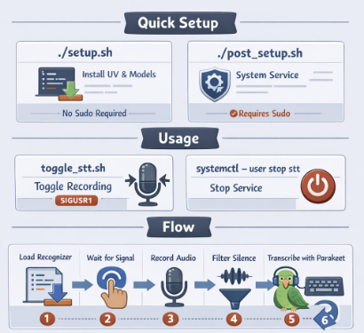

# Speech-to-Text Setup

Minimalist speech-to-text for Linux. No GPU required.
Transcribes speech and pastes text at the cursor.
Uses sherpa-onnx with NeMo Parakeet model.

## Quick Setup

```bash
# Install uv, download models, create lock file (no sudo)
./setup.sh

# Install system deps, create systemd service (requires sudo)
./post_setup.sh
```
Tested with Ubuntu 24.04

## Usage

Script runs as a daemon (started by systemctl or on login).

- **toggle_stt.sh**: Toggle recording start/stop (sends SIGUSR1)
- `systemctl --user stop stt`: Stop the service

## Flow



1. Script loads recognizer on startup
2. Waits for start signal (Ctrl+C or toggle_stt.sh)
3. Opens mic, records until stop signal
4. Closes mic, filters silence with VAD
5. Transcribes with Parakeet
6. Types result at cursor with xdotool
7. Repeats from step 2

## GNOME Keyboard Shortcuts

Settings -> Keyboard -> Custom Shortcuts:

**Toggle Recording:**
- Name: STT Toggle
- Command: `/path/to/sst/toggle_stt.sh`
- Shortcut: Ctrl + Space

## Troubleshooting

**No speech detected**: Check mic volume, speak louder

**Text not pasting**: Requires X11 (not Wayland), check `echo $XDG_SESSION_TYPE`

**Test xdotool**: `xdotool type "test"`

## Licenses

- [Silero VAD](https://github.com/snakers4/silero-vad) (model from [cjpais/Handy](https://github.com/cjpais/Handy)): MIT License
- [sherpa-onnx](https://github.com/k2-fsa/sherpa-onnx) (k2-fsa/sherpa-onnx): Apache License 2.0
